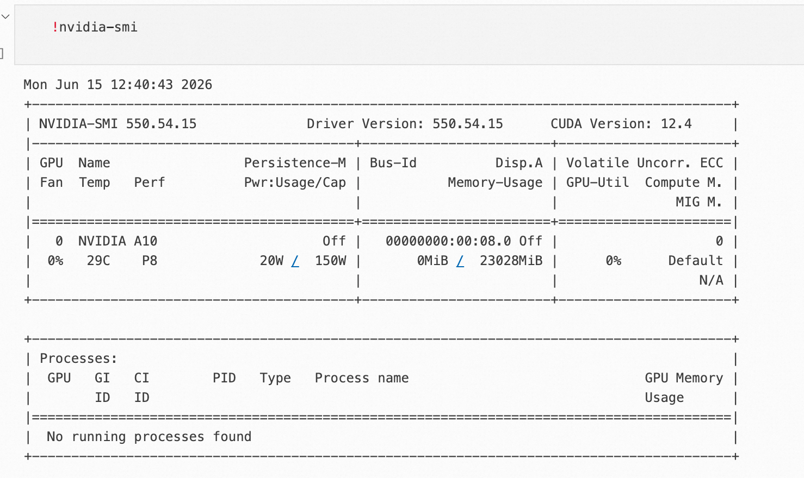
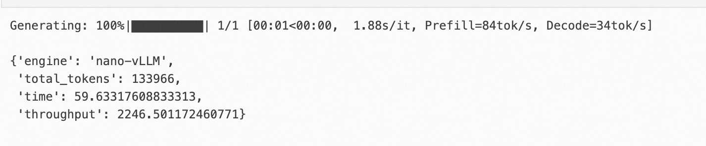

# 推理 Infra 学习实录 01：从 nano-vLLM 开始

> 归档状态（GitHub 发布副本）：保留 2026-06-15 截图与历史输出记录；本轮未做 GPU 复测。以下“本次”指历史实验，修正后的代码不代表已复测。ModelScope 发布 URL 尚未知，不表示已发布。
> [配套 Notebook](main.ipynb) · [下一篇](../02/article.md)。Notebook 输出与执行计数已清空，历史截图保留在 [assets](assets/)。
> 版本边界：安装与源码说明对齐已核对 [nano-vLLM commit bb823b3](https://github.com/GeeeekExplorer/nano-vllm/tree/bb823b3e06983d71485a8e1f23715ebd87d98ef8)，不代表 CUDA 依赖已全部锁定。
> 路径说明：`/mnt/workspace` 是 ModelScope 平台缓存示例，模型目录以 `snapshot_download()` 返回值为准。

最近想系统学习一下大模型推理系统。

刚开始接触推理 Infra 的时候，很多词会同时冒出来：vLLM、KV Cache、prefill、decode、CUDA Graph、FlashAttention、请求调度……如果一开始就直接看生产级框架，容易很快迷路。

所以我打算从一个更轻量的项目开始：**nano-vLLM**。

nano-vLLM 是一个从零实现的轻量级 vLLM。它保留了推理框架里很核心的机制，比如 prefill、decode、KV Cache、请求调度、FlashAttention 和 CUDA Graph，但代码规模更小，更适合用来入门。

这篇文章先不深入源码，只做第一件事：**在魔搭 Notebook 上跑通 nano-vLLM，并记录一次简单 benchmark**。

本篇会按这个顺序来：

1. 确认 GPU 和 Python 环境。
2. 安装 nano-vLLM。
3. 用 ModelScope 下载 Qwen3-0.6B。
4. 用 nano-vLLM 跑通第一次生成。
5. 用 chat template 跑一次更正式的聊天输入。
6. 跑一次 nano-vLLM benchmark。
7. 简单理解 benchmark 结果。

## 1. 为什么从 nano-vLLM 开始

我选择 nano-vLLM 的原因很直接：它比较小，但不是玩具。

它能帮助我先建立几个基本概念的直觉：

- `prefill`：prompt 第一次进入模型时的计算阶段。
- `decode`：模型逐 token 生成的阶段。
- `KV Cache`：生成过程中缓存 attention 的 key/value，避免重复计算。
- `batch 调度`：多条请求如何一起进入模型。
- `FlashAttention`：高效 attention 计算。
- `CUDA Graph`：减少重复调度开销的一种优化方式。

第一篇先不追求“全部讲透”，只追求一件事：**把它跑起来，并知道自己在看什么结果**。

## 2. 确认环境

大模型推理最常见的问题，往往不是代码写错，而是环境没有配好。

所以第一步先看 GPU：

```python
!nvidia-smi
```

我这次使用的是一张 NVIDIA A10，显存大约 23GB：

```text
GPU: NVIDIA A10
Memory: 23028 MiB
Driver Version: 550.54.15
CUDA Version: 12.4
```



再看 Python 和 PyTorch：

```python
import sys

print("Python:", sys.version)

try:
    import torch
    print("PyTorch:", torch.__version__)
    print("Torch CUDA:", torch.version.cuda)
    print("CUDA available:", torch.cuda.is_available())
    if torch.cuda.is_available():
        print("GPU:", torch.cuda.get_device_name(0))
except Exception as e:
    print("Torch check failed:", e)
```

本次环境输出：

```text
Python: 3.12.13
PyTorch: 2.10.0+cu128
Torch CUDA: 12.8
CUDA available: True
GPU: NVIDIA A10
```

这里我主要确认两件事：

```text
torch.cuda.is_available() == True
GPU 可以被 PyTorch 识别
```

如果这一步不通过，后面安装 nano-vLLM 也没有太大意义。

## 3. 安装 nano-vLLM

安装方式沿用 nano-vLLM README，但归档示例固定到已核对 commit，与下文源码阅读对齐：

```python
%pip install git+https://github.com/GeeeekExplorer/nano-vllm.git@bb823b3e06983d71485a8e1f23715ebd87d98ef8
```

它会尝试安装项目声明的依赖，比如：

```text
torch>=2.4.0
triton>=3.0.0
transformers>=4.51.0
flash-attn
xxhash
```

在 Notebook 里建议使用 `%pip`，而不是直接写 `pip`。这样更容易确保包安装到当前 Notebook Kernel 对应的 Python 环境里。

如果环境里还没有 ModelScope，也可以安装一下：

```python
%pip install modelscope
```

这里有一个小提醒：`torch`、`triton`、`flash-attn` 都和 CUDA 环境强相关。如果安装 `flash-attn` 失败，通常不是 nano-vLLM 本身的问题，而是 Python / PyTorch / CUDA 版本组合不匹配。

## 4. 获取源码

如果只是运行 nano-vLLM，前面的 pip 安装已经够了。

但我这次是为了学习推理 Infra，所以也把源码 clone 下来，方便后面继续读 [`bench.py`](https://github.com/GeeeekExplorer/nano-vllm/blob/bb823b3e06983d71485a8e1f23715ebd87d98ef8/bench.py) 和核心实现。

```python
from pathlib import Path
import subprocess

repo_dir = Path("upstream/nano-vllm")
commit = "bb823b3e06983d71485a8e1f23715ebd87d98ef8"
if not repo_dir.exists():
    repo_dir.parent.mkdir(parents=True, exist_ok=True)
    subprocess.run(
        ["git", "clone", "https://github.com/GeeeekExplorer/nano-vllm.git", str(repo_dir)],
        check=True,
    )
    subprocess.run(["git", "-C", str(repo_dir), "checkout", commit], check=True)
else:
    print("保留已有 checkout，不自动 pull 或覆盖：", repo_dir)
actual_commit = subprocess.check_output(
    ["git", "-C", str(repo_dir), "rev-parse", "HEAD"], text=True,
).strip()
if actual_commit != commit:
    raise RuntimeError(f"源码版本不符：{actual_commit}；请另选空目录克隆固定版本，不覆盖已有工作。")
print("source commit:", actual_commit)
```

只有目标目录不存在时才 clone；已有 checkout 只检查、不强制覆盖。安装包与阅读源码必须对齐同一 commit，不能把已有目录误当成固定版本。

## 5. 用 ModelScope 下载小模型

学习阶段不建议一上来就跑大模型。

这里选择：

```text
Qwen/Qwen3-0.6B
```

它体积比较小，适合作为第一次实验模型。

下载代码：

```python
from modelscope import snapshot_download

model_dir = snapshot_download(
    "Qwen/Qwen3-0.6B",
    cache_dir="/mnt/workspace/.cache/modelscope",
)

print("model_dir =", model_dir)
```

本次下载后的路径是：

```text
/mnt/workspace/.cache/modelscope/Qwen/Qwen3-0___6B
```

检查一下模型目录：

```python
import os

print("模型目录:", model_dir)
print("目录内容:")
for name in os.listdir(model_dir)[:30]:
    print(" -", name)
```

可以看到里面有：

```text
config.json
generation_config.json
model.safetensors
tokenizer.json
tokenizer_config.json
vocab.json
```

nano-vLLM 接收的是本地模型目录，所以这里的 `model_dir` 后面会直接传给 `LLM(...)`。

## 6. 第一次推理

先跑一个最简单的 prompt，确认推理链路通了。

本节、chat 和 benchmark 各自运行在独立子进程中。`subprocess.run(..., check=True)` 会等当前进程结束后才继续，主 Notebook 不持有 LLM 或模型 tensor，避免显存残留与重复初始化默认进程组。如果执行过旧版同进程单元，先重启 kernel。

```python
import subprocess
import sys

code = r'''
import sys
from nanovllm import LLM, SamplingParams

model_dir = sys.argv[1]
llm = LLM(
    model_dir,
    enforce_eager=True,
    tensor_parallel_size=1,
)

sampling_params = SamplingParams(
    temperature=0.6,
    max_tokens=256,
)

prompts = ["Hello, Nano-vLLM."]
outputs = llm.generate(prompts, sampling_params)
print(outputs[0]["text"])
'''
subprocess.run([sys.executable, "-c", code, str(model_dir)], check=True)
```

这里几个参数先简单理解：

- `model_dir`：ModelScope 下载后的本地模型目录。
- `enforce_eager=True`：先用 eager 模式跑通，减少 CUDA Graph 相关干扰。
- `tensor_parallel_size=1`：使用单卡推理。
- `temperature=0.6`：控制生成随机性。
- `max_tokens=256`：最多生成 256 个 token。

运行后可以看到进度条：

```text
Generating: 100%|██████████| 1/1 [00:12<00:00, 12.42s/it, Prefill=2tok/s, Decode=38tok/s]
```

这说明 nano-vLLM 已经完成了一次生成。

这一步我更关注的不是模型回答得多好，而是这条链路已经通了：

```text
prompt
-> tokenizer
-> 完整 prefill
-> sampling 首 token
-> decode + sampling 继续生成
-> output
```

这条链路可以简单理解成：一段文字从输入到生成结果，中间会经历的推理流程。

`prompt` 是用户输入的文本，例如：

```text
请用三句话解释什么是大模型推理引擎。
```

如果是聊天模型，通常还会用 chat template 包一层，把它变成类似“user 提问、assistant 回答”的格式。

`tokenizer` 负责把文字转换成模型能理解的 token id。模型不能直接处理自然语言文本，它真正接收的是一串数字。例如：

```text
"Hello, Nano-vLLM."
```

会被转换成类似：

```python
[9707, 11, 12345, 13]
```

`prefill` 是模型第一次读取整个 prompt 的阶段。假设 prompt 有 100 个 token，prefill 会一次性处理这 100 个 token，并为它们计算 attention 需要的 KV Cache。可以把它理解成：先把题目读完，并把中间计算结果缓存起来。

完整 `prefill` 完成后，先根据末位置的 logits 采样首个输出 token；若采用 chunked prefill，未完成 prompt 的中间 chunk 不会追加输出 token。随后 `decode` 以刚采样的 token 为输入，写入它的 KV，再计算并采样下一个 token，如此继续。因为前面的 prompt 和已处理 token 的 KV Cache 已经存起来了，所以 decode 不需要每次重新计算全部上下文。

`sampling` 既发生在完整 prefill 后，也发生在每轮 decode 后。模型会给出“下一个 token 可能是什么”的分数，sampling 根据这些分数和 `temperature` 等参数，选出真正要生成的下一个 token。`temperature` 越低，输出通常越稳定；越高，随机性越强。

最后，当模型生成到结束符，或者达到 `max_tokens` 限制，就停止生成。生成出来的 token id 会再通过 tokenizer 解码回文本，这就是最终看到的 `output`。

所以这条链路可以再压缩成一句话：

```text
prompt 是输入，tokenizer 把文字变成 token，完整 prefill 后采样首 token，decode 继续逐 token 计算与采样，最后解码成文本输出。
```

## 7. 使用 chat template

上面的例子更像是普通文本续写。

对于 Qwen3 这类聊天模型，更推荐使用 tokenizer 的 `apply_chat_template`，把输入包装成 user / assistant 对话格式。

chat 示例也创建自己的 eager LLM，不复用上一段已经退出的进程或对象：

```python
import subprocess
import sys

code = r'''
import sys
from transformers import AutoTokenizer
from nanovllm import LLM, SamplingParams

model_dir = sys.argv[1]
llm = LLM(model_dir, enforce_eager=True, tensor_parallel_size=1)
tokenizer = AutoTokenizer.from_pretrained(model_dir, use_fast=True)

sampling_params = SamplingParams(
    temperature=0.6,
    max_tokens=512,
)

raw_prompts = [
    "请用三句话解释什么是大模型推理引擎。"
]

chat_prompts = [
    tokenizer.apply_chat_template(
        [{"role": "user", "content": p}],
        tokenize=False,
        add_generation_prompt=True,
    )
    for p in raw_prompts
]

outputs = llm.generate(chat_prompts, sampling_params)
print(outputs[0]["text"])
'''
subprocess.run([sys.executable, "-c", code, str(model_dir)], check=True)
```

本次输出里可以看到 Qwen3 的 thinking 过程：

```text
<think>
嗯，用户让我用三句话解释什么是大模型推理引擎。首先，我需要明确大模型和推理引擎的关系...
</think>

大模型推理引擎是通过预训练模型进行智能推理的核心组件...
```

这个现象也提醒我：**推理引擎负责高效执行，prompt 格式会影响模型行为**。

普通 prompt 和 chat template 的区别可以先这样理解：

| 写法 | 更像什么 |
|---|---|
| `prompts = ["Hello, Nano-vLLM."]` | 文本续写 |
| `apply_chat_template(...)` | 聊天问答 |

所以如果是聊天模型，后面更推荐使用 chat template。

## 8. 一个额外观察：Qwen3.5-0.8B 不能直接替换运行

跑通 Qwen3-0.6B 后，我也尝试过把模型路径直接替换成 Qwen3.5-0.8B：

```python
llm = LLM(
    ".cache/modelscope/models/Qwen/Qwen3.5-0.8B",
    enforce_eager=True,
    tensor_parallel_size=1,
)
```

结果在初始化阶段报错：

```text
AttributeError: 'Qwen3_5Config' object has no attribute 'max_position_embeddings'
```

这个报错一开始看起来像是少了一个字段，但继续看 config 后会发现，Qwen3.5-0.8B 和 Qwen3-0.6B 并不是简单的同结构替换：

```text
顶层 model_type: qwen3_5
architectures: Qwen3_5ForConditionalGeneration
真正的文本模型配置在 text_config 中
text_config.model_type: qwen3_5_text
layer_types: linear_attention / full_attention 混合
```

这说明 Qwen3.5-0.8B 不能简单当作 Qwen3-0.6B 的替换模型。它涉及新的 config 组织方式、hybrid attention 结构，以及可能不同的权重命名。

这个失败反而是很好的学习材料。它把问题从“如何调用模型”推进到了更底层：

```text
推理引擎如何识别一个新模型？
Hugging Face config 如何映射到推理引擎内部模型类？
权重 key 和模型参数如何对齐？
不同 attention 结构是否还能复用同一套 KV Cache？
```

所以这篇先只跑通 Qwen3-0.6B。Qwen3.5-0.8B 更适合作为后续“nano-vLLM 适配新模型”的单独案例。

## 9. nano-vLLM Benchmark

跑通生成以后，再做一次 benchmark。

这里使用随机 token 作为输入，所以它测试的是推理吞吐、调度和 KV Cache 管理，不是模型回答质量。

benchmark 也使用独立子进程，单独创建启用 CUDA Graph 的 LLM。预热后先同步 CUDA，计时使用 `perf_counter()`，结束时再同步，并按实际输出 `token_ids` 计数，而不是把请求上限当成实测 token 数。

```python
import subprocess
import sys

code = r'''
import sys
from time import perf_counter
from random import randint, seed
import torch
from nanovllm import LLM, SamplingParams

model_dir = sys.argv[1]
seed(0)

num_seqs = 256
max_input_len = 1024
max_output_len = 1024

llm = LLM(
    model_dir,
    enforce_eager=False,
    max_model_len=4096,
    tensor_parallel_size=1,
)

prompt_token_ids = [
    [randint(0, 10000) for _ in range(randint(100, max_input_len))]
    for _ in range(num_seqs)
]

sampling_params = [
    SamplingParams(
        temperature=0.6,
        ignore_eos=True,
        max_tokens=randint(100, max_output_len),
    )
    for _ in range(num_seqs)
]

llm.generate(["Benchmark: "], SamplingParams())

torch.cuda.synchronize()
t = perf_counter()
outputs = llm.generate(prompt_token_ids, sampling_params, use_tqdm=False)
torch.cuda.synchronize()
elapsed = perf_counter() - t

total_tokens = sum(len(output["token_ids"]) for output in outputs)
throughput = total_tokens / elapsed

nano_result = {
    "engine": "nano-vLLM",
    "total_tokens": total_tokens,
    "time": elapsed,
    "throughput": throughput,
}
print(nano_result)
'''
subprocess.run([sys.executable, "-c", code, str(model_dir)], check=True)
```

2026-06-15 的历史结果如下。截图和数字保留原样：旧代码按请求输出上限求和并用 `time.time()` 计时；本轮没有用修正代码重跑，不能将旧值当成新计时口径的结果。

```text
{
  "engine": "nano-vLLM",
  "total_tokens": 133966,
  "time": 59.63317608833313,
  "throughput": 2246.501172460771
}
```



整理成表格：

| 指标 | 数值 |
|---|---:|
| 推理引擎 | nano-vLLM |
| 请求数 | 256 |
| 输入长度 | 100 到 1024 token 随机 |
| 输出长度 | 100 到 1024 token 随机 |
| 总输出 token | 133,966 |
| 耗时 | 59.63 s |
| 吞吐 | 2246.50 tokens/s |

这里的 `throughput` 表示平均每秒生成多少 token。

## 10. 如何解读 benchmark

这个 benchmark 不是聊天质量测试。

它使用的是随机 token：

```python
prompt_token_ids = [
    [randint(0, 10000) for _ in range(randint(100, max_input_len))]
    for _ in range(num_seqs)
]
```

所以它主要测试：

- 推理吞吐。
- batch 调度。
- KV Cache 管理。
- decode 性能。
- CUDA Graph 路径。

它不测试：

- 模型回答质量。
- 中文能力。
- 指令跟随能力。

如果要测试真实聊天效果，应该使用自然语言 prompt，并通过 `apply_chat_template` 构造聊天格式。

这也是我第一次对“推理框架”和“模型能力”做区分：

```text
模型能力：回答得好不好。
推理框架：同样的模型和请求，能不能更快、更稳、更省显存地跑。
```

## 11. 这次学到了什么

这次 Notebook 跑下来，我完成了几件事：

1. 在魔搭 Notebook 上确认了 GPU 和 PyTorch CUDA 环境。
2. 通过 pip 安装了 nano-vLLM。
3. 用 ModelScope 下载了 Qwen3-0.6B。
4. 用 nano-vLLM 跑通了普通 prompt 推理。
5. 用 chat template 跑通了聊天格式输入。
6. 观察到 Qwen3.5-0.8B 不能直接替换运行。
7. 用随机 token 跑了一次 benchmark。

几个原本比较抽象的概念，也开始变得具体：

- `prefill`：prompt 首次进入模型的阶段。
- `decode`：逐 token 生成阶段。
- `KV Cache`：推理吞吐和显存管理的核心。
- `benchmark`：观察推理系统性能的方法。

这一篇只是入口。

下一篇可以开始顺着一次 `generate()` 调用读源码，重点看这些文件：

- [`nanovllm/engine/llm_engine.py`](https://github.com/GeeeekExplorer/nano-vllm/blob/bb823b3e06983d71485a8e1f23715ebd87d98ef8/nanovllm/engine/llm_engine.py)
- [`nanovllm/engine/scheduler.py`](https://github.com/GeeeekExplorer/nano-vllm/blob/bb823b3e06983d71485a8e1f23715ebd87d98ef8/nanovllm/engine/scheduler.py)
- [`nanovllm/engine/block_manager.py`](https://github.com/GeeeekExplorer/nano-vllm/blob/bb823b3e06983d71485a8e1f23715ebd87d98ef8/nanovllm/engine/block_manager.py)
- [`nanovllm/engine/model_runner.py`](https://github.com/GeeeekExplorer/nano-vllm/blob/bb823b3e06983d71485a8e1f23715ebd87d98ef8/nanovllm/engine/model_runner.py)
- [`nanovllm/layers/attention.py`](https://github.com/GeeeekExplorer/nano-vllm/blob/bb823b3e06983d71485a8e1f23715ebd87d98ef8/nanovllm/layers/attention.py)

我的理解是：真正开始学习推理 Infra，不一定要从生产级框架庞大的源码开始。先用 nano-vLLM 这样的小项目跑通一遍，再带着问题去读源码，会更容易建立整体感。
